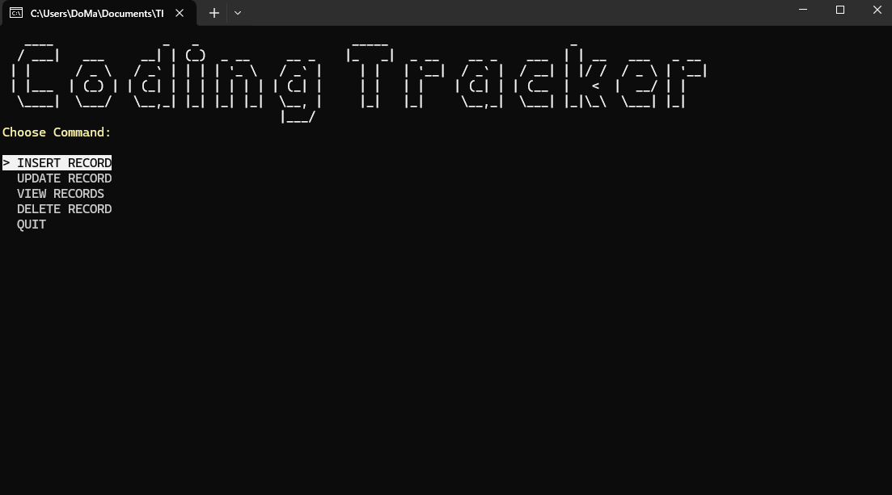

# CodingTracker
CodingTracker is a console app implemented in C# to track coding hours. It uses [Dapper](https://www.learndapper.com) for SQLite interactions, as well as [Spectre](spectreconsole.net) for styling.
## Usage
To use this app, just launch it either using Visual Studio (or any IDE) or run the executable to launch the console. Choose an option from the dropdown to either INSERT, UPDATE, or REMOVE an entry. Or alternatively, you can view all items in the database.

## Motivation
This project was implemented as part of my roadmap to mastering .NET development.
## License
[MIT](https://choosealicense.com/licenses/mit/)